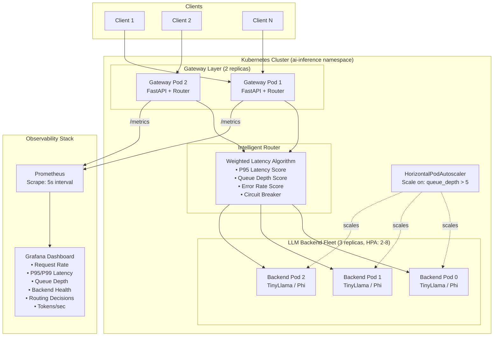
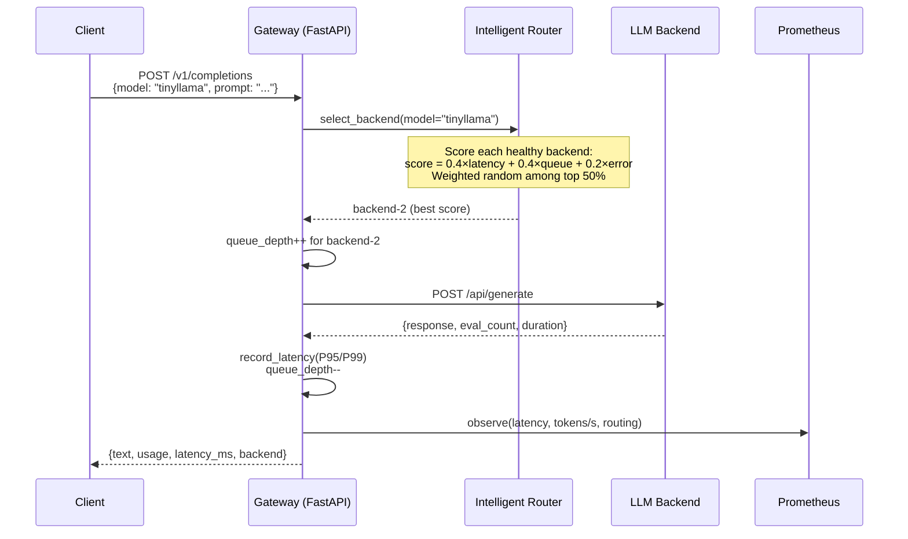
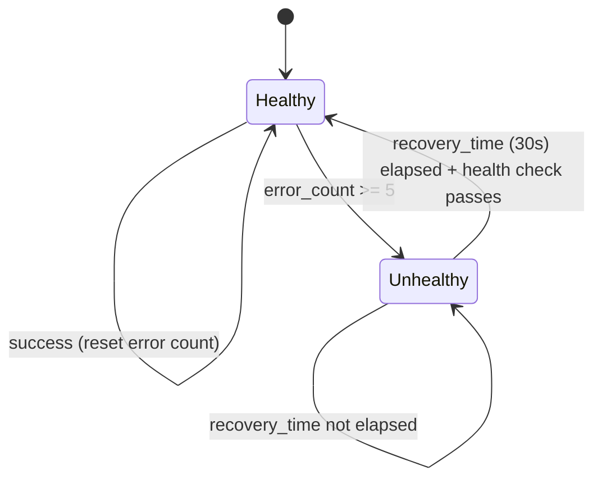

# AI Inference Gateway

An intelligent routing layer for LLM inference workloads, deployed on Kubernetes. Routes requests to backend model-serving pods using latency-aware, health-conscious load balancing with auto-scaling and full observability.

## Architecture



## Request Flow



## Circuit Breaker



## Features

- **Intelligent Routing**: Weighted load balancing based on backend latency (P95), queue depth, model availability, and pod health
- **Multi-Model Support**: Route to different models based on request parameters
- **Auto-Scaling**: HPA scales inference pods based on request queue depth
- **Observability**: Prometheus metrics with Grafana dashboards — latency histograms, throughput, error rates
- **Health-Aware**: Automatic backend removal on failure, gradual re-introduction on recovery
- **Graceful Degradation**: Request queuing and backpressure when all backends are saturated

## Quick Start

### Prerequisites

- Docker Desktop with Kubernetes enabled
- kubectl configured
- Python 3.11+
- Helm (for Prometheus/Grafana)

### Deploy

```bash
# Build gateway image
docker build -t ai-inference-gateway:latest -f docker/Dockerfile .

# Deploy backend LLM pods
kubectl apply -f k8s/base/

# Deploy monitoring stack
kubectl apply -f k8s/monitoring/

# Port-forward gateway
kubectl port-forward svc/inference-gateway 8000:8000

# Port-forward Grafana
kubectl port-forward svc/grafana 3000:3000
```

### Test

```bash
# Send inference request
curl -X POST http://localhost:8000/v1/completions \
  -H "Content-Type: application/json" \
  -d '{"model": "tinyllama", "prompt": "Hello, world!", "max_tokens": 50}'

# Check routing metrics
curl http://localhost:8000/metrics
```

## Project Structure

```
ai-inference-gateway/
├── gateway/              # FastAPI application
│   ├── main.py          # App entrypoint
│   ├── router.py        # Intelligent routing logic
│   ├── backends.py      # Backend pool management
│   ├── metrics.py       # Prometheus metrics
│   ├── health.py        # Health checking
│   └── config.py        # Configuration
├── k8s/
│   ├── base/            # Core K8s manifests
│   └── monitoring/      # Prometheus + Grafana
├── docker/
│   └── Dockerfile       # Gateway container
├── tests/               # Unit + integration tests
├── scripts/             # Helper scripts
└── README.md
```

## Tech Stack

- **Gateway**: Python 3.11, FastAPI, httpx, prometheus-client
- **Inference Backends**: Ollama (TinyLlama, Phi-2)
- **Orchestration**: Kubernetes, HPA
- **Observability**: Prometheus, Grafana
- **Infrastructure**: Docker, kubectl
